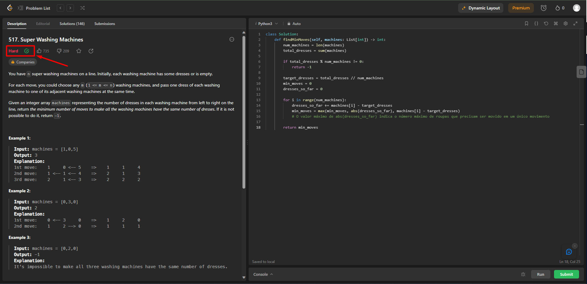
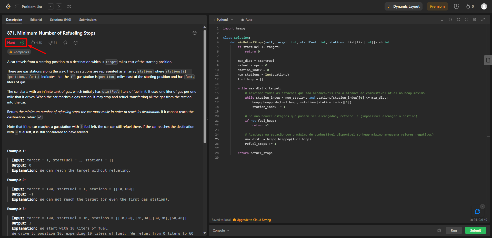
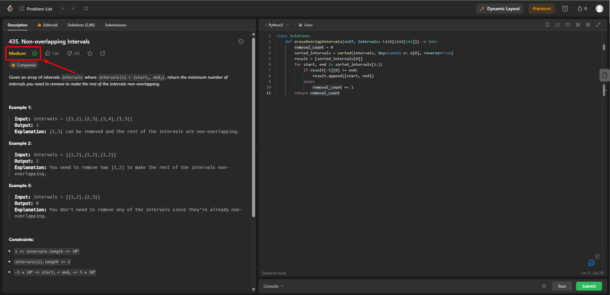

# Questões do LeetCode

**Número da Lista**: 3 
**Conteúdo da Disciplina**: Greed (Ambiciosos) 

## Alunos
|Matrícula | Aluno |
| -- | -- |
| 21/1029559  | Rafael Brito Bosi Rodrigues |

## Sobre 

Este repositório tem como objetivo compilar a resolução de alguns problemas encontrados na plataforma [LeetCode](https://leetcode.com/), tais problemas estão dentro do escopo do conteúde abrangido por Greed (Algoritmos Ambiciosos).

Exercícios Solucionados:

- [517 - Super Washing Machines](https://leetcode.com/problems/super-washing-machines/description/) | **Difícil**
- [871 - Minimum Number of Refueling Stops](https://leetcode.com/problems/minimum-number-of-refueling-stops/description/) | **Difícil**
- [435 - Non-overlapping Intervals](https://leetcode.com/problems/non-overlapping-intervals/) | **Média**

## Screenshots

Seguem aqui os screenshots das questões solucionadas, a seta de cada print serve apenas para apontar para o indicador que demonstra que o problema foi resolvido com sucesso.

### 517 - Super Washing Machines

Para ver a solução dessa questão clicar [aqui](./exercicios/517.py).

O algoritmo utilizado pode ser considerado ambicioso uma vez que tenta otimizar a distribuição de roupas nas máquinas de forma a minimizar o número de movimentos necessários. Além disso, determina o número máximo de roupas que podem ser movidas em um único movimento.

### 871 - Minimum Number of Refueling Stops

Para ver a solução dessa questão clicar [aqui](./exercicios/871.py).

O algoritmo utilizado pode ser considerado ambicioso pois no contexto de minimizar as paradas para reabastecimento de combustível em uma rota, ele sempre opta por reabastecer no posto de gasolina mais vantajoso em termos de combustível disponível. 

### 435 - Non-overlapping Intervals

Para ver a solução dessa questão clicar [aqui](./exercicios/435.py).

O algoritmo utilizado pode ser considerado ambicioso pois no contexto deste código, o algoritmo tenta minimizar a contagem de remoções de intervalos para que os intervalos restantes não se sobreponham.

O algoritmo percorre os intervalos, classificando-os por ordem decrescente de início e, em seguida, adiciona intervalos à lista "result" de forma que haja o mínimo de sobreposições. 

## Instalação 
**Linguagem**: Python 3 

Como o LeetCode é uma plataforma online que roda na web, não é necessário baixar nenhum tipo de dependência.

## Uso 

Para testar as soluções aqui propostas basta ir até o arquivo de ["exercicios"](./exercicios/), copiar o código da questão desejada, navegar até o link da questão que pretende testar e subimeter o código ao juiz online.

Importante ressaltar que é necessário selecionar a linguagem "Python3" na plataforma, caso contrário, o código não irá funcionar.

## Outros 

Para acessar o vídeo onde os códigos e algoritmos são explicados e detalhados, basta clicar [aqui](./video/Gravação%20-%20Greed.mp4).

OBS: O arquivo de vídeo esta com a extensão .mp4, o que torna necessário o download do arquivo para assistir ao vídeo.

